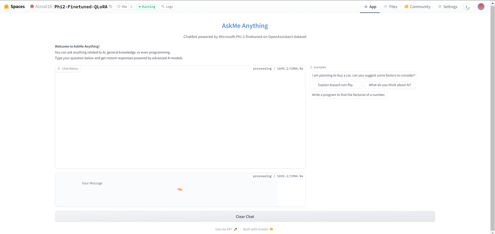

# Phi 2 Finetuned bot

# Chatbot Application

This project is a chatbot application powered by a fine-tuned language model. The chatbot can answer questions related to AI, general knowledge, or programming.

## Project Structure 

```plaintext
app.py
model/ 
    ├── adapter_config.json
    ├── adapter_model.safetensors
    ├── added_tokens.json
    ├── merges.txt
    ├── special_tokens_map.json
    ├── tokenizer_config.json
    ├── tokenizer.json
    └── vocab.json
README.md
requirements.txt
```

## Setup

1. **Clone the repository:**

        ```bash
        git clone <repository-url>
        cd <repository-directory>
        ```

2. **Install the required packages:**

        ```bash
        pip install -r requirements.txt
        ```

## Usage

To run the chatbot application, execute the following command:

```bash
python app.py
```

This will launch a Gradio interface where you can interact with the chatbot. Alternatively, you can visit the [online demo](https://huggingface.co/spaces/Azreal18/Phi2-Finetuned-QLoRA).

Here's how it will look:


## License

This project is licensed under the MIT License.

